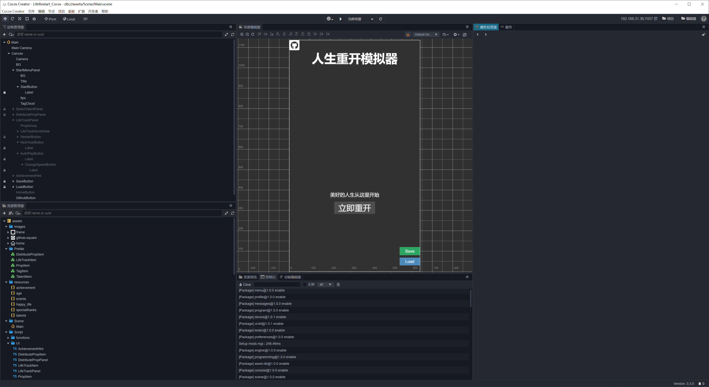
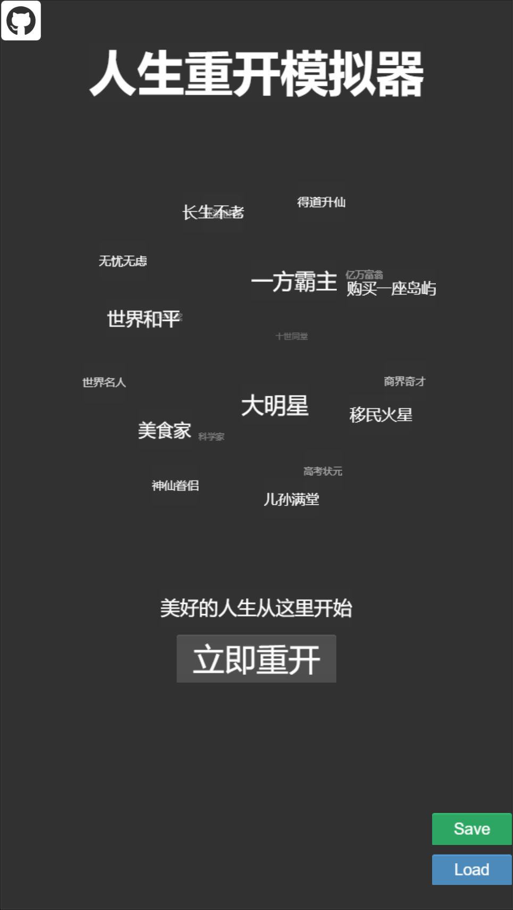
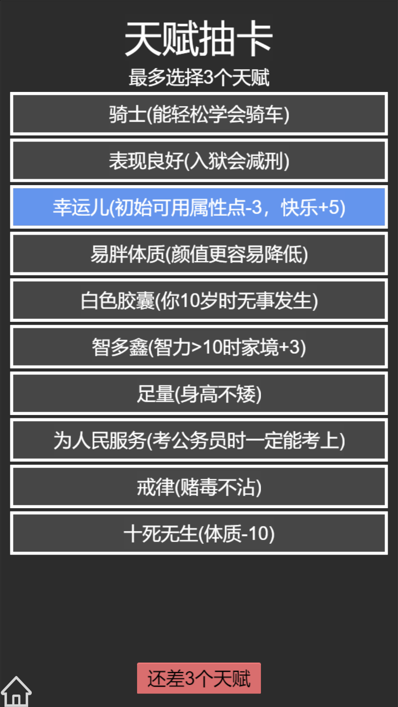
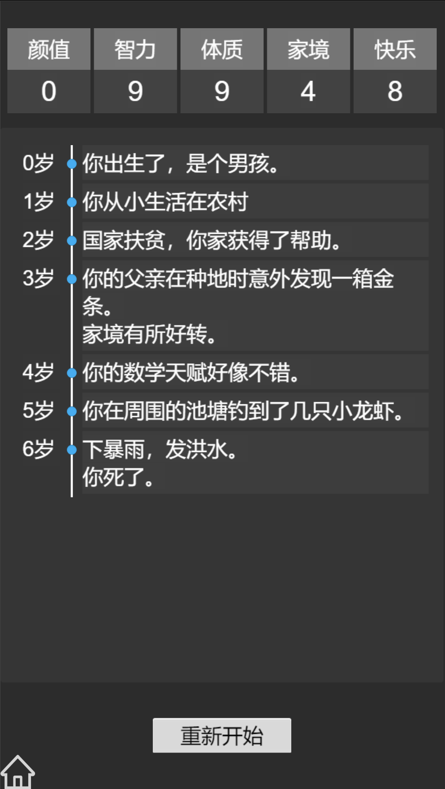

# LifeRestart_Cocos
Game Life Restart With Cocos Creator

使用CocosCreator3.3重写了游戏。
体验地址：https://gameall3d.github.io/games/lifeRestart/

原版的游戏工程：https://github.com/VickScarlet/lifeRestart

原版的体验地址：https://liferestart.syaro.io/view/

## 开发环境配置

1. 到[Cocos Creator官网](https://www.cocos.com/creator)下载编辑器。

2. 克隆工程

3. 使用编辑器打开

## 一些界面展示

## 后续计划

1. 加入职业发展
2. 加入家族系统？
3. 加入3D形象？